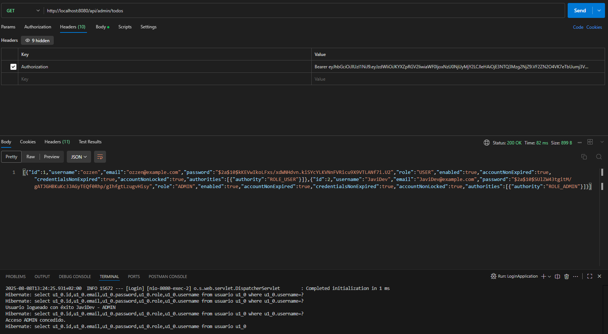

# API de Autenticación con Spring Security JWT en Spring Boot (Docker Ready)

## Descripción

Proyecto backend en Java que permite registro, login y acceso protegido mediante JWT. Listo para ejecutarlo mediante Docker.

## Tecnologías

- Java 21
- Spring Boot
- Spring Security
- JWT
- Maven
- MySQL
- Postman (para pruebas)
- Docker    

## Funcionalidades (V 1.2)

- Registro de usuarios (V 1.0)
- Login y generación de JWT (V 1.0)
- Validación de token (V 1.0)
- Acceso protegido con roles (V 1.0)
- Seguridad basada en Spring Security (V 1.0)

- Roles ADMIN y USER (V 1.1)
- Configuración lista para ejecutar la app y su base de datos MySQL usando Docker y Docker Compose (V 1.2)

## Ejecutar y probar el proyecto

### Ejecutar en local
Clonar el proyecto y renombrar \src\main\resources\example-local.yml por application-local.yml e introducir tus credenciales. \
Ejecutar el proyecto (mvn spring-boot:run).

### Ejecutar con Docker 
Clonar el proyecto y renombrar el archivo .env.example por .env e introducir tus credenciales. \
Constuir y levantar los contenedores (docker-compose up --build).

##

- Registro de usuario (Genera un JWT): \
POST http://localhost:8080/api/auth/register

- Login (obtener JWT): \
POST http://localhost:8080/api/auth/login

- Endpoint protegido (requiere JWT en el header): \
GET http://localhost:8080/otro/test

- Endpoint protegido (requiere JWT de ADMIN en el header): \
GET http://localhost:8080/api/admin/todos

- Imagen que muestra el correcto funcionamiento del endpoint api/admin/todos. Al pasarle el token de un ADMIN devuelve una lista (json) con todos los usuarios que estan registrados en la base de datos 

## Proximas mejoras

- Usar este proyecto como base para crear un gestor CRM.
- Desarrollar un Frontend sencillo.

## Desarrollado por JaviDev707